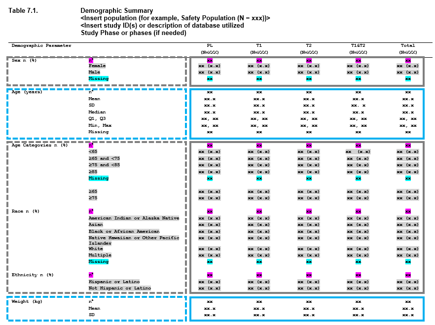

# Getting Started

## How **Tplyr** Works

When you look at a summary table within a clinical report, you can often
break it down into some basic pieces. Consider this output.



Different variables are being summarized in chunks of the table, which
we refer to as “layers”. Additionally, this table really only contains a
few different types of summaries, which makes many of the calculations
rather redundant. This drives the motivation behind **Tplyr**. The
containing table is encapsulated within the
[`tplyr_table()`](https://atorus-research.github.io/Tplyr/reference/tplyr_table.md)
object, and each section, or “layer”, within the summary table can be
broken down into a
[`tplyr_layer()`](https://atorus-research.github.io/Tplyr/reference/tplyr_layer.md)
object.

### The `tplyr_table()` Object

The
[`tplyr_table()`](https://atorus-research.github.io/Tplyr/reference/tplyr_table.md)
object is the conceptual “table” that contains all of the logic
necessary to construct and display the data. **Tplyr** tables are made
up of one or more layers. Each layer contains an instruction for a
summary to be performed. The
[`tplyr_table()`](https://atorus-research.github.io/Tplyr/reference/tplyr_table.md)
object contains those layers, and the general data, metadata, and logic
necessary to prepare the data before any layers are constructed.

When a
[`tplyr_table()`](https://atorus-research.github.io/Tplyr/reference/tplyr_table.md)
is created, it will contain the following bindings:

- `target` - The dataset upon which summaries will be performed
- `count_layer_formats` - Default formats to be used on count layers in
  the table
- `shift_layer_formats` - Default formats to be used on shift layers in
  the table
- `desc_layer_formats` - Default formats to be used on descriptive
  statistics layers in the table
- `pop_data` - The dataset containing population information. This
  defaults to the `target` dataset
- `cols` - A categorical variable in the `target` dataset to present
  summaries grouped by column (in addition to the `treat_var` variable)
- `table_where` - The `where` clause provided, used to subset the
  `target` dataset
- `treat_var` - Variable used to distinguish treatment groups in the
  `target` dataset.
- `header_n` - Default header N values based on `treat_var` and any
  `cols` variables
- `pop_treat_var` - Variable used to distinguish treatment groups in
  `pop_data` dataset (if different than the `treat_var` variable in the
  `target` dataset)
- `layers` - The container for individual layers of a
  [`tplyr_table()`](https://atorus-research.github.io/Tplyr/reference/tplyr_table.md)
- `treat_grps` - Additional treatment groups to be added to the summary
  (i.e. Total)

The function
[`tplyr_table()`](https://atorus-research.github.io/Tplyr/reference/tplyr_table.md)
allows you a basic interface to instantiate the object. Modifier
functions are available to change individual parameters catered to your
analysis.

``` r
t <- tplyr_table(tplyr_adsl, TRT01P, where = SAFFL == "Y")
t
#> *** tplyr_table ***
#> Target (data.frame):
#>  Name:  tplyr_adsl
#>  Rows:  254
#>  Columns:  49 
#> treat_var variable (quosure)
#>  TRT01P
#> header_n:  header groups
#> treat_grps groupings (list)
#> Table Columns (cols):
#> where: == SAFFL Y
#> Number of layer(s): 0
#> layer_output: <Table Not Built Yet>
```

### The `tplyr_layer()` Object

Users of **Tplyr** interface with
[`tplyr_layer()`](https://atorus-research.github.io/Tplyr/reference/tplyr_layer.md)
objects using the `group_<type>` family of functions. This family
specifies the type of summary that is to be performed within a layer.
`count` layers are used to create summary counts of some discrete
variable. `shift` layers summarize the counts for different changes in
states. Lastly, `desc` layers create descriptive statistics.

- **Count Layers**
  - Count layers allow you to easily create summaries based on counting
    distinct or non-distinct occurrences of values within a variable.
    Additionally, this layer allows you to create n (%) summaries where
    you’re also summarizing the proportion of instances a value occurs
    compared to some denominator. Count layers are also capable of
    producing counts of nested relationships. For example, if you want
    to produce counts of an overall outside group, and then the subgroup
    counts within that group, you can simply specify the target variable
    as `vars(OutsideVariable, InsideVariable)`. This allows you to do
    tables like Adverse Events where you want to see the Preferred Terms
    within Body Systems, all in one layer. Count layers can also
    distinguish between distinct and non-distinct counts. Using some
    specified by variable, you can count the unique occurrences of some
    variable within the specified by grouping, including the target.
    This allows you to do a summary like unique subjects and their
    proportion experiencing some adverse event, and the number of total
    occurrences of that adverse event.
- **Descriptive Statistics Layers**
  - Descriptive statistics layers perform summaries on continuous
    variables. There are a number of summaries built into **Tplyr**
    already that you can perform, including n, mean, median, standard
    deviation, variance, min, max, interquartile range, Q1, Q3, and
    missing value counts. From these available summaries, the default
    presentation of a descriptive statistics layer will output ‘n’,
    ‘Mean (SD)’, ‘Median’, ‘Q1, Q3’, ‘Min, Max’, and ‘Missing’. You can
    change these summaries using
    [`set_format_strings()`](https://atorus-research.github.io/Tplyr/reference/set_format_strings.md),
    and you can also add your own summaries using
    [`set_custom_summaries()`](https://atorus-research.github.io/Tplyr/reference/set_custom_summaries.md).
    This allows you to easily implement any additional summary
    statistics you want presented.
- **Shift Layers**
  - Shift layers are largely an abstraction of the count layer - and in
    fact, we re-use a lot of the same code to process these layers. In
    many shift tables, the “from” state is presented as rows in the
    table, and the “to” state is presented as columns. This clearly lays
    out how many subjects changed state between a baseline and some
    point in time. Shift layers give you an intuitive API to break these
    out, using a very similar interface as the other layers. There are
    also a number of modifier functions available to control nuanced
    aspects, such as how denominators should be applied.

``` r
cnt <- group_count(t, AGEGR1)
cnt
#> *** count_layer ***
#> Self:  count_layer < 0x559d7f96e0a8 >
#> Parent:  tplyr_table < 0x559d7f612198 >
#> target_var: 
#>  AGEGR1
#> by: 
#> where: TRUE
#> Layer(s): 0

dsc <- group_desc(t, AGE)
dsc
#> *** desc_layer ***
#> Self:  desc_layer < 0x559d7fad2518 >
#> Parent:  tplyr_table < 0x559d7f612198 >
#> target_var: 
#>  AGE
#> by: 
#> where: TRUE
#> Layer(s): 0

shf <- group_shift(t, vars(row=COMP8FL, column=COMP24FL))
shf
#> *** shift_layer ***
#> Self:  shift_layer < 0x559d7fbd66f0 >
#> Parent:  tplyr_table < 0x559d7f612198 >
#> target_var: 
#>  COMP8FL
#>  COMP24FL
#> by: 
#> where: TRUE
#> Layer(s): 0
```

### Adding Layers to a Table

Everyone has their own style of coding - so we’ve tried to be flexible
to an extent. Overall, **Tplyr** is built around tidy syntax, so all of
our object construction supports piping with
[`magrittr`](https://magrittr.tidyverse.org/articles/magrittr.html)
(i.e. `%>%`).

There are two ways to add layers to a
[`tplyr_table()`](https://atorus-research.github.io/Tplyr/reference/tplyr_table.md):
[`add_layer()`](https://atorus-research.github.io/Tplyr/reference/layer_attachment.md)
and
[`add_layers()`](https://atorus-research.github.io/Tplyr/reference/layer_attachment.md).
The difference is that
[`add_layer()`](https://atorus-research.github.io/Tplyr/reference/layer_attachment.md)
allows you to construct the layer within the call to
[`add_layer()`](https://atorus-research.github.io/Tplyr/reference/layer_attachment.md),
whereas with
[`add_layers()`](https://atorus-research.github.io/Tplyr/reference/layer_attachment.md)
you can attach multiple layers that have already been constructed
upfront:

``` r
t <- tplyr_table(tplyr_adsl, TRT01P) %>% 
  add_layer(
    group_count(AGEGR1, by = "Age categories n (%)")
  )
```

Within
[`add_layer()`](https://atorus-research.github.io/Tplyr/reference/layer_attachment.md),
the syntax to constructing the count layer for Age Categories was
written on the fly.
[`add_layer()`](https://atorus-research.github.io/Tplyr/reference/layer_attachment.md)
is special in that it also allows you to use piping to use modifier
functions on the layer being constructed

``` r
t <- tplyr_table(tplyr_adsl, TRT01P) %>% 
  add_layer(
    group_count(AGEGR1, by = "Age categories n (%)") %>% 
      set_format_strings(f_str("xx (xx.x%)", n, pct)) %>% 
      add_total_row()
  )
```

[`add_layers()`](https://atorus-research.github.io/Tplyr/reference/layer_attachment.md),
on the other hand, lets you isolate the code to construct a particular
layer if you wanted to separate things out more. Some might find this
cleaner to work with if you have a large number of layers being
constructed.

``` r
t <- tplyr_table(tplyr_adsl, TRT01P) 

l1 <- group_count(t, AGEGR1, by = "Age categories n (%)")
l2 <- group_desc(t, AGE, by = "Age (years)")

t <- add_layers(t, l1, l2)
```

Notice that when you construct the layers separately, you need to
specify the table to which they belong.
[`add_layer()`](https://atorus-research.github.io/Tplyr/reference/layer_attachment.md)
does this automatically.
[`tplyr_table()`](https://atorus-research.github.io/Tplyr/reference/tplyr_table.md)
and
[`tplyr_layer()`](https://atorus-research.github.io/Tplyr/reference/tplyr_layer.md)
objects are built on environments, and the parent/child relationships
are very important. This is why, even though the layer knows who its
table parent is, the layers still need to be attached to the table (as
the table doesn’t know who its children are). [Advanced
R](https://adv-r.hadley.nz/environments.html) does a very good job at
explaining what environments in R are, their benefits, and how to use
them.

#### A Note Before We Go Deeper

Notice that when you construct a
[`tplyr_table()`](https://atorus-research.github.io/Tplyr/reference/tplyr_table.md)
or a
[`tplyr_layer()`](https://atorus-research.github.io/Tplyr/reference/tplyr_layer.md)
that what displays is a summary of information about the table or layer?
That’s because when you create these objects - it constructs the
metadata, but does not process the actual data. This allows you to
construct and make sure the pieces of your table fit together before you
do the data processing - and it gives you a container to hold all of
this metadata, and use it later if necessary.

To generate the data from a
[`tplyr_table()`](https://atorus-research.github.io/Tplyr/reference/tplyr_table.md)
object, you use the function
[`build()`](https://atorus-research.github.io/Tplyr/reference/build.md):

``` r
t <- tplyr_table(tplyr_adsl, TRT01P) %>% 
  add_layer(
    group_count(AGEGR1, by = "Age categories n (%)")
  )

t %>% 
  build() %>% 
  kable()
```

| row_label1           | row_label2 | var1_Placebo | var1_Xanomeline High Dose | var1_Xanomeline Low Dose | ord_layer_index | ord_layer_1 | ord_layer_2 |
|:---------------------|:-----------|:-------------|:--------------------------|:-------------------------|----------------:|------------:|------------:|
| Age categories n (%) | \<65       | 14 ( 16.3%)  | 11 ( 13.1%)               | 8 ( 9.5%)                |               1 |           1 |           1 |
| Age categories n (%) | \>80       | 30 ( 34.9%)  | 18 ( 21.4%)               | 29 ( 34.5%)              |               1 |           1 |           2 |
| Age categories n (%) | 65-80      | 42 ( 48.8%)  | 55 ( 65.5%)               | 47 ( 56.0%)              |               1 |           1 |           3 |

But there’s more you can get from **Tplyr**. It’s great to have the
formatted numbers, but what about the numeric data behind the scenes?
Maybe a number looks suspicious and you need to investigate *how* you
got that number. What if you want to calculate your own statistics based
off of the counts? You can get that information as well using
[`get_numeric_data()`](https://atorus-research.github.io/Tplyr/reference/get_numeric_data.md).
This returns the numeric data from each layer as a list of data frames:

``` r
get_numeric_data(t) %>% 
  head() %>% 
  kable()
```

[TABLE]

By storing pertinent information, you can get more out of a **Tplyr**
object than processed data for display. And by specifying when you want
to get data out of **Tplyr**, we can save you from repeatedly processing
data while your constructing your outputs - which is particularly useful
when that computation starts taking time.

### Constructing Layers

The bulk of **Tplyr** coding comes from constructing your layers and
specifying the work you want to be done. Before we get into this, it’s
important to discuss how **Tplyr** handles string formatting.

#### String Formatting in **Tplyr**

String formatting in **Tplyr** is controlled by an object called an
[`f_str()`](https://atorus-research.github.io/Tplyr/reference/f_str.md),
which is also the name of function you use to create these formats. To
set these format strings into a
[`tplyr_layer()`](https://atorus-research.github.io/Tplyr/reference/tplyr_layer.md),
you use the function
[`set_format_strings()`](https://atorus-research.github.io/Tplyr/reference/set_format_strings.md),
and this usage varies slightly between layer types (which is covered in
other vignettes).

So - why is this object necessary. Consider this example:

``` r

t <- tplyr_table(tplyr_adsl, TRT01P) %>% 
  add_layer(
    group_desc(AGE, by = "Age (years)") %>% 
      set_format_strings(
        'n' = f_str('xx', n),
        'Mean (SD)' = f_str('xx.xx (xx.xxx)', mean, sd)
      )
  )

t %>% 
  build() %>% 
  kable()
```

| row_label1  | row_label2 | var1_Placebo   | var1_Xanomeline High Dose | var1_Xanomeline Low Dose | ord_layer_index | ord_layer_1 | ord_layer_2 |
|:------------|:-----------|:---------------|:--------------------------|:-------------------------|----------------:|------------:|------------:|
| Age (years) | n          | 86             | 84                        | 84                       |               1 |           1 |           1 |
| Age (years) | Mean (SD)  | 75.21 ( 8.590) | 74.38 ( 7.886)            | 75.67 ( 8.286)           |               1 |           1 |           2 |

In a perfect world, the
[`f_str()`](https://atorus-research.github.io/Tplyr/reference/f_str.md)
calls wouldn’t be necessary - but in reality they allow us to infer a
great deal of information from very few user inputs. In the calls that
you see above:

- The row labels in the `row_label2` column are taken from the left side
  of each `=` in
  [`set_format_strings()`](https://atorus-research.github.io/Tplyr/reference/set_format_strings.md)
- The string formats, including integer length and decimal precision,
  and exact presentation formatting are taken from the strings within
  the first parameter of each
  [`f_str()`](https://atorus-research.github.io/Tplyr/reference/f_str.md)
  call
- The second and greater parameters within each
  [`f_str()`](https://atorus-research.github.io/Tplyr/reference/f_str.md)
  call determine the descriptive statistic summaries that will be
  performed. This is connected to a number of default summaries
  available within **Tplyr**, but you can also create your own summaries
  (covered in other vignettes). The default summaries that are built in
  include:
  - `n` = Number of observations
  - `mean` = Mean
  - `sd` = Standard Deviation
  - `var` = Variance
  - `iqr` = Inter Quartile Range
  - `q1` = 1st quartile
  - `q3` = 3rd quartile
  - `min` = Minimum value
  - `max` = Maximum value
  - `missing` = Count of NA values
- When two summaries are placed on the same
  [`f_str()`](https://atorus-research.github.io/Tplyr/reference/f_str.md)
  call, then those two summaries are formatted into the same string.
  This allows you to do a “Mean (SD)” type format where both numbers
  appear.

This simple user input controls a significant amount of work in the back
end of the data processing, and the
[`f_str()`](https://atorus-research.github.io/Tplyr/reference/f_str.md)
object allows that metadata to be collected.

[`f_str()`](https://atorus-research.github.io/Tplyr/reference/f_str.md)
objects are also used with count layers as well to control the data
presentation. Instead of specifying the summaries performed, you use
`n`, `pct`, `distinct_n`, and `distinct_pct` for your parameters and
specify how you would like the values displayed. Using `distinct_n` and
`distinct_pct` should be combined with specifying a `distinct_by()`
variable using
[`set_distinct_by()`](https://atorus-research.github.io/Tplyr/reference/set_distinct_by.md).

``` r
tplyr_table(tplyr_adsl, TRT01P) %>% 
  add_layer(
    group_count(AGEGR1, by = "Age categories") %>% 
      set_format_strings(f_str('xx (xx.x)',n,pct))
  ) %>% 
  build() %>% 
  kable()
```

| row_label1     | row_label2 | var1_Placebo | var1_Xanomeline High Dose | var1_Xanomeline Low Dose | ord_layer_index | ord_layer_1 | ord_layer_2 |
|:---------------|:-----------|:-------------|:--------------------------|:-------------------------|----------------:|------------:|------------:|
| Age categories | \<65       | 14 (16.3)    | 11 (13.1)                 | 8 ( 9.5)                 |               1 |           1 |           1 |
| Age categories | \>80       | 30 (34.9)    | 18 (21.4)                 | 29 (34.5)                |               1 |           1 |           2 |
| Age categories | 65-80      | 42 (48.8)    | 55 (65.5)                 | 47 (56.0)                |               1 |           1 |           3 |

``` r

tplyr_table(tplyr_adsl, TRT01P) %>% 
  add_layer(
    group_count(AGEGR1, by = "Age categories") %>% 
      set_format_strings(f_str('xx',n))
  ) %>% 
  build() %>% 
  kable()
```

| row_label1     | row_label2 | var1_Placebo | var1_Xanomeline High Dose | var1_Xanomeline Low Dose | ord_layer_index | ord_layer_1 | ord_layer_2 |
|:---------------|:-----------|:-------------|:--------------------------|:-------------------------|----------------:|------------:|------------:|
| Age categories | \<65       | 14           | 11                        | 8                        |               1 |           1 |           1 |
| Age categories | \>80       | 30           | 18                        | 29                       |               1 |           1 |           2 |
| Age categories | 65-80      | 42           | 55                        | 47                       |               1 |           1 |           3 |

Really - format strings allow you to present your data however you like.

``` r
tplyr_table(tplyr_adsl, TRT01P) %>% 
  add_layer(
    group_count(AGEGR1, by = "Age categories") %>% 
      set_format_strings(f_str('xx (•◡•) xx.x%',n,pct))
  ) %>% 
  build() %>% 
  kable()
```

| row_label1     | row_label2 | var1_Placebo   | var1_Xanomeline High Dose | var1_Xanomeline Low Dose | ord_layer_index | ord_layer_1 | ord_layer_2 |
|:---------------|:-----------|:---------------|:--------------------------|:-------------------------|----------------:|------------:|------------:|
| Age categories | \<65       | 14 (•◡•) 16.3% | 11 (•◡•) 13.1%            | 8 (•◡•) 9.5%             |               1 |           1 |           1 |
| Age categories | \>80       | 30 (•◡•) 34.9% | 18 (•◡•) 21.4%            | 29 (•◡•) 34.5%           |               1 |           1 |           2 |
| Age categories | 65-80      | 42 (•◡•) 48.8% | 55 (•◡•) 65.5%            | 47 (•◡•) 56.0%           |               1 |           1 |           3 |

But should you? Probably not.

## Layer Types

### Descriptive Statistic Layers

As covered under string formatting,
[`set_format_strings()`](https://atorus-research.github.io/Tplyr/reference/set_format_strings.md)
controls a great deal of what happens within a descriptive statistics
layer. Note that there are some built in defaults to what’s output:

``` r
tplyr_table(tplyr_adsl, TRT01P) %>% 
  add_layer(
    group_desc(AGE, by = "Age (years)")
  ) %>% 
  build() %>% 
  kable()
```

| row_label1  | row_label2 | var1_Placebo | var1_Xanomeline High Dose | var1_Xanomeline Low Dose | ord_layer_index | ord_layer_1 | ord_layer_2 |
|:------------|:-----------|:-------------|:--------------------------|:-------------------------|----------------:|------------:|------------:|
| Age (years) | n          | 86           | 84                        | 84                       |               1 |           1 |           1 |
| Age (years) | Mean (SD)  | 75.2 ( 8.59) | 74.4 ( 7.89)              | 75.7 ( 8.29)             |               1 |           1 |           2 |
| Age (years) | Median     | 76.0         | 76.0                      | 77.5                     |               1 |           1 |           3 |
| Age (years) | Q1, Q3     | 69.2, 81.8   | 70.8, 80.0                | 71.0, 82.0               |               1 |           1 |           4 |
| Age (years) | Min, Max   | 52, 89       | 56, 88                    | 51, 88                   |               1 |           1 |           5 |
| Age (years) | Missing    | 0            | 0                         | 0                        |               1 |           1 |           6 |

To override these defaults, just specify the summaries that you want to
be performed using
[`set_format_strings()`](https://atorus-research.github.io/Tplyr/reference/set_format_strings.md)
as described above. But what if **Tplyr** doesn’t have a built in
function to do the summary statistic that you want to see? Well - you
can make your own! This is where
[`set_custom_summaries()`](https://atorus-research.github.io/Tplyr/reference/set_custom_summaries.md)
comes into play. Let’s say you want to derive a geometric mean.

``` r
tplyr_table(tplyr_adsl, TRT01P) %>%
  add_layer(
    group_desc(AGE, by = "Sepal Length") %>%
      set_custom_summaries(
        geometric_mean = exp(sum(log(.var[.var > 0]), na.rm=TRUE) / length(.var))
      ) %>%
      set_format_strings(
        'Geometric Mean (SD)' = f_str('xx.xx (xx.xxx)', geometric_mean, sd)
      )
  ) %>% 
  build() %>% 
  kable()
```

| row_label1   | row_label2          | var1_Placebo   | var1_Xanomeline High Dose | var1_Xanomeline Low Dose | ord_layer_index | ord_layer_1 | ord_layer_2 |
|:-------------|:--------------------|:---------------|:--------------------------|:-------------------------|----------------:|------------:|------------:|
| Sepal Length | Geometric Mean (SD) | 74.70 ( 8.590) | 73.94 ( 7.886)            | 75.18 ( 8.286)           |               1 |           1 |           1 |

In
[`set_custom_summaries()`](https://atorus-research.github.io/Tplyr/reference/set_custom_summaries.md),
first you name the summary being performed. This is important - that
name is what you use in the
[`f_str()`](https://atorus-research.github.io/Tplyr/reference/f_str.md)
call to incorporate it into a format. Next, you program or call the
function desired. What happens in the background is that this is used in
a call to
[`dplyr::summarize()`](https://dplyr.tidyverse.org/reference/summarise.html) -
so use similar syntax. Use the variable name `.var` in your custom
summary function. This is necessary because it allows a generic variable
name to be used when multiple target variables are specified - and
therefore the function can be applied to both target variables.

Sometimes there’s a need to present multiple variables summarized side
by side. **Tplyr** allows you to do this as well.

``` r
tplyr_table(tplyr_adsl, TRT01P) %>% 
  add_layer(
    group_desc(vars(AGE, AVGDD), by = "Age and Avg. Daily Dose")
  ) %>% 
  build() %>% 
  kable()
```

| row_label1              | row_label2 | var1_Placebo | var1_Xanomeline High Dose | var1_Xanomeline Low Dose | var2_Placebo | var2_Xanomeline High Dose | var2_Xanomeline Low Dose | ord_layer_index | ord_layer_1 | ord_layer_2 |
|:------------------------|:-----------|:-------------|:--------------------------|:-------------------------|:-------------|:--------------------------|:-------------------------|----------------:|------------:|------------:|
| Age and Avg. Daily Dose | n          | 86           | 84                        | 84                       | 86           | 84                        | 84                       |               1 |           1 |           1 |
| Age and Avg. Daily Dose | Mean (SD)  | 75.2 ( 8.59) | 74.4 ( 7.89)              | 75.7 ( 8.29)             | 0.0 ( 0.00)  | 71.6 ( 8.11)              | 54.0 ( 0.00)             |               1 |           1 |           2 |
| Age and Avg. Daily Dose | Median     | 76.0         | 76.0                      | 77.5                     | 0.0          | 75.1                      | 54.0                     |               1 |           1 |           3 |
| Age and Avg. Daily Dose | Q1, Q3     | 69.2, 81.8   | 70.8, 80.0                | 71.0, 82.0               | 0.0, 0.0     | 70.2, 76.9                | 54.0, 54.0               |               1 |           1 |           4 |
| Age and Avg. Daily Dose | Min, Max   | 52, 89       | 56, 88                    | 51, 88                   | 0, 0         | 54, 79                    | 54, 54                   |               1 |           1 |           5 |
| Age and Avg. Daily Dose | Missing    | 0            | 0                         | 0                        | 0            | 0                         | 0                        |               1 |           1 |           6 |

**Tplyr** summarizes both variables and merges them together. This makes
creating tables where you need to compare BASE, AVAL, and CHG next to
each other nice and simple. Note the use of
[`dplyr::vars()`](https://dplyr.tidyverse.org/reference/vars.html) - in
any situation where you’d like to use multiple variable names in a
parameter, use
[`dplyr::vars()`](https://dplyr.tidyverse.org/reference/vars.html) to
specify the variables. You can use text strings in the calls to
[`dplyr::vars()`](https://dplyr.tidyverse.org/reference/vars.html) as
well.

### Count Layers

Count layers generally allow you to create “n” and “n (%)” count type
summaries. There are a few extra features here as well. Let’s say that
you want a total row within your counts. This can be done with
[`add_total_row()`](https://atorus-research.github.io/Tplyr/reference/add_total_row.md):

``` r
tplyr_table(tplyr_adsl, TRT01P) %>% 
  add_layer(
    group_count(AGEGR1, by = "Age categories") %>% 
      add_total_row()
  ) %>% 
  build() %>% 
  kable()
```

| row_label1     | row_label2 | var1_Placebo | var1_Xanomeline High Dose | var1_Xanomeline Low Dose | ord_layer_index | ord_layer_1 | ord_layer_2 |
|:---------------|:-----------|:-------------|:--------------------------|:-------------------------|----------------:|------------:|------------:|
| Age categories | \<65       | 14 ( 16.3%)  | 11 ( 13.1%)               | 8 ( 9.5%)                |               1 |           1 |           1 |
| Age categories | \>80       | 30 ( 34.9%)  | 18 ( 21.4%)               | 29 ( 34.5%)              |               1 |           1 |           2 |
| Age categories | 65-80      | 42 ( 48.8%)  | 55 ( 65.5%)               | 47 ( 56.0%)              |               1 |           1 |           3 |
| Age categories | Total      | 86 (100.0%)  | 84 (100.0%)               | 84 (100.0%)              |               1 |           1 |           4 |

Sometimes it’s also necessary to count summaries based on distinct
values. **Tplyr** allows you to do this as well with
[`set_distinct_by()`](https://atorus-research.github.io/Tplyr/reference/set_distinct_by.md):

``` r
tplyr_table(tplyr_adae, TRTA) %>% 
  add_layer(
    group_count('Subjects with at least one adverse event') %>% 
      set_distinct_by(USUBJID) %>% 
      set_format_strings(f_str('xx', n))
  ) %>% 
  build() %>% 
  kable()
```

| row_label1                               | var1_Placebo | var1_Xanomeline High Dose | var1_Xanomeline Low Dose | ord_layer_index | ord_layer_1 |
|:-----------------------------------------|:-------------|:--------------------------|:-------------------------|----------------:|:------------|
| Subjects with at least one adverse event | 47           | 111                       | 118                      |               1 | NA          |

There’s another trick going on here - to create a summary with row label
text like you see above, text strings can be used as the target
variables. Here, we use this in combination with
[`set_distinct_by()`](https://atorus-research.github.io/Tplyr/reference/set_distinct_by.md)
to count distinct subjects.

Adverse event tables often call for counting AEs of something like a
body system and counting actual events within that body system.
**Tplyr** has means of making this simple for the user as well.

``` r
tplyr_table(tplyr_adae, TRTA) %>% 
  add_layer(
    group_count(vars(AEBODSYS, AEDECOD))
  ) %>% 
  build() %>% 
  head() %>% 
  kable()
```

| row_label1                             | row_label2                             | var1_Placebo | var1_Xanomeline High Dose | var1_Xanomeline Low Dose | ord_layer_index | ord_layer_1 | ord_layer_2 |
|:---------------------------------------|:---------------------------------------|:-------------|:--------------------------|:-------------------------|----------------:|------------:|------------:|
| SKIN AND SUBCUTANEOUS TISSUE DISORDERS | SKIN AND SUBCUTANEOUS TISSUE DISORDERS | 47 (100.0%)  | 111 (100.0%)              | 118 (100.0%)             |               1 |           1 |         Inf |
| SKIN AND SUBCUTANEOUS TISSUE DISORDERS | ACTINIC KERATOSIS                      | 0 ( 0.0%)    | 1 ( 0.9%)                 | 0 ( 0.0%)                |               1 |           1 |           1 |
| SKIN AND SUBCUTANEOUS TISSUE DISORDERS | ALOPECIA                               | 1 ( 2.1%)    | 0 ( 0.0%)                 | 0 ( 0.0%)                |               1 |           1 |           2 |
| SKIN AND SUBCUTANEOUS TISSUE DISORDERS | BLISTER                                | 0 ( 0.0%)    | 2 ( 1.8%)                 | 8 ( 6.8%)                |               1 |           1 |           3 |
| SKIN AND SUBCUTANEOUS TISSUE DISORDERS | COLD SWEAT                             | 3 ( 6.4%)    | 0 ( 0.0%)                 | 0 ( 0.0%)                |               1 |           1 |           4 |
| SKIN AND SUBCUTANEOUS TISSUE DISORDERS | DERMATITIS ATOPIC                      | 1 ( 2.1%)    | 0 ( 0.0%)                 | 0 ( 0.0%)                |               1 |           1 |           5 |

Here we again use
[`dplyr::vars()`](https://dplyr.tidyverse.org/reference/vars.html) to
specify multiple target variables. When used in a count layer, **Tplyr**
knows automatically that the first variable is a grouping variable for
the second variable, and counts shall be produced for both then merged
together.

### Shift Layers

Lastly, let’s talk about shift layers. A common example of this would be
looking at a subject’s lab levels at baseline versus some designated
evaluation point. This would tell us, for example, how many subjects
were high at baseline for a lab test vs. after an intervention has been
introduced. The shift layer in **Tplyr** is intended for creating shift
tables that show these data as a matrix, where one state will be
presented in rows and the other in columns. Let’s look at an example.

``` r
# Tplyr can use factor orders to dummy values and order presentation
tplyr_adlb$ANRIND <- factor(tplyr_adlb$ANRIND, c("L", "N", "H"))
tplyr_adlb$BNRIND <- factor(tplyr_adlb$BNRIND, c("L", "N", "H"))

tplyr_table(tplyr_adlb, TRTA, where = PARAMCD == "CK") %>%
  add_layer(
    group_shift(vars(row=BNRIND, column=ANRIND), by=PARAM) %>% 
      set_format_strings(f_str("xx (xxx%)", n, pct))
  ) %>% 
  build() %>% 
  kable()
```

| row_label1            | row_label2 | var1_Placebo_L | var1_Placebo_N | var1_Placebo_H | var1_Xanomeline High Dose_L | var1_Xanomeline High Dose_N | var1_Xanomeline High Dose_H | var1_Xanomeline Low Dose_L | var1_Xanomeline Low Dose_N | var1_Xanomeline Low Dose_H | ord_layer_index | ord_layer_1 | ord_layer_2 |
|:----------------------|:-----------|:---------------|:---------------|:---------------|:----------------------------|:----------------------------|:----------------------------|:---------------------------|:---------------------------|:---------------------------|----------------:|------------:|------------:|
| Creatine Kinase (U/L) | L          | 0 ( 0%)        | 0 ( 0%)        | 0 ( 0%)        | 0 ( 0%)                     | 0 ( 0%)                     | 0 ( 0%)                     | 0 ( 0%)                    | 0 ( 0%)                    | 0 ( 0%)                    |               1 |          35 |           1 |
| Creatine Kinase (U/L) | N          | 0 ( 0%)        | 27 ( 87%)      | 4 ( 13%)       | 0 ( 0%)                     | 17 ( 85%)                   | 2 ( 10%)                    | 0 ( 0%)                    | 14 ( 93%)                  | 1 ( 7%)                    |               1 |          35 |           2 |
| Creatine Kinase (U/L) | H          | 0 ( 0%)        | 0 ( 0%)        | 0 ( 0%)        | 0 ( 0%)                     | 0 ( 0%)                     | 1 ( 5%)                     | 0 ( 0%)                    | 0 ( 0%)                    | 0 ( 0%)                    |               1 |          35 |           3 |

The underlying process of shift tables is the same as count layers -
we’re counting the number of occurrences of something by a set of
grouping variables. This differs in that **Tplyr** uses the
[`group_shift()`](https://atorus-research.github.io/Tplyr/reference/layer_constructors.md)
API to use the same basic interface as other tables, but translate your
target variables into the row variable and the column variable.
Furthermore, there is some enhanced control over how denominators should
behave that is necessary for a shift layer.

## Where to go from here?

There’s quite a bit more to learn! And we’ve prepared a number of other
vignettes to help you get what you need out of **Tplyr**.

- Learn more about table level settings in
  [`vignette("table")`](https://atorus-research.github.io/Tplyr/articles/table.md)
- Learn more about descriptive statistics layers in
  [`vignette("desc")`](https://atorus-research.github.io/Tplyr/articles/desc.md)
- Learn more about count and shift layers in
  [`vignette("count")`](https://atorus-research.github.io/Tplyr/articles/count.md)
- Learn more about shift layers in
  [`vignette("shift")`](https://atorus-research.github.io/Tplyr/articles/shift.md)
- Learn more about calculating risk differences in
  [`vignette("riskdiff")`](https://atorus-research.github.io/Tplyr/articles/riskdiff.md)
- Learn more about sorting **Tplyr** tables in
  [`vignette("sort")`](https://atorus-research.github.io/Tplyr/articles/sort.md)
- Learn more about using **Tplyr** options in
  [`vignette("options")`](https://atorus-research.github.io/Tplyr/articles/options.md)
- And finally, learn more about producing and outputting styled tables
  using **Tplyr** in
  [`vignette("styled-table")`](https://atorus-research.github.io/Tplyr/articles/styled-table.md)

## References

In building **Tplyr**, we needed some additional resources in addition
to our personal experience to help guide design. PHUSE has done some
great work to create guidance for standard outputs with collaboration
between multiple pharmaceutical companies and the FDA. You can find some
of the resource that we referenced below.

[Analysis and Displays Associated with Adverse
Events](https://phuse.s3.eu-central-1.amazonaws.com/Deliverables/Standard+Analyses+and+Code+Sharing/Analyses+and+Displays+Associated+with+Adverse+Events+Focus+on+Adverse+Events+in+Phase+2-4+Clinical+Trials+and+Integrated+Summary.pdf)

[Analyses and Displays Associated with Demographics, Disposition, and
Medications](https://phuse.s3.eu-central-1.amazonaws.com/Deliverables/Standard+Analyses+and+Code+Sharing/Analyses+%26+Displays+Associated+with+Demographics,+Disposition+and+Medication+in+Phase+2-4+Clinical+Trials+and+Integrated+Summary+Documents.pdf)

[Analyses and Displays Associated with Measures of Central
Tendency](https://phuse.s3.eu-central-1.amazonaws.com/Deliverables/Standard+Analyses+and+Code+Sharing/Analyses+%26+Displays+Associated+with+Measures+of+Central+Tendency-+Focus+on+Vital+Sign,+Electrocardiogram+%26+Laboratory+Analyte+Measurements+in+Phase+2-4+Clinical+Trials+and+Integrated+Submissions.pdf)
