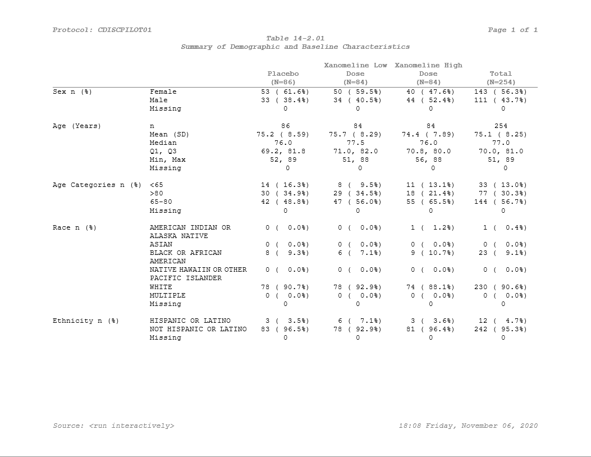

# Producing a Styled Table

In the other vignettes we talk about how to get the most out of
**Tplyr** when it comes to preparing your data. The last step we need to
cover is how to get from the data output by **Tplyr** to a presentation
ready table.

There are a few things left to do after a table is built. These steps
will vary based on what package you’re using for presentation - but
within this vignette we will demonstrate how to use
[‘huxtable’](https://hughjonesd.github.io/huxtable/) to prepare your
table and [‘pharmaRTF’](https://github.com/atorus-research/pharmaRTF) to
write the output.

After a **Tplyr** table is built, you will likely have to:

- Sort the table however you wish using the provided order variables
- Drop the order variables once sorted
- Reorder the columns however you’d like them for presentation
- Apply row masking to blank out repeating values in row labels
- Set column headers within the data frame
- Create and style your ‘huxtable’ output
- Set up your RTF output with ‘pharmaRTF’

Let’s build a demographics table to see how this all works.

### Preparing the data

``` r
tplyr_adsl <- tplyr_adsl %>% 
  mutate(
    SEX = recode(SEX, M = "Male", F = "Female"), 
    RACE = factor(RACE, c("AMERICAN INDIAN OR ALASKA NATIVE", "ASIAN", "BLACK OR AFRICAN AMERICAN", 
                          "NATIVE HAWAIIN OR OTHER PACIFIC ISLANDER", "WHITE", "MULTIPLE"))
  )

t <- tplyr_table(tplyr_adsl, TRT01P) %>% 
  add_total_group() %>% 
  add_layer(name = 'Sex', 
    group_count(SEX, by = "Sex n (%)") %>% 
      set_missing_count(f_str('xx', n), Missing=NA, denom_ignore=TRUE)
  ) %>% 
  add_layer(name = 'Age',
    group_desc(AGE, by = "Age (Years)")
  ) %>% 
  add_layer(name = 'Age group', 
    group_count(AGEGR1, by = "Age Categories n (%)") %>% 
      set_missing_count(f_str('xx', n), Missing=NA, denom_ignore=TRUE)
  ) %>% 
  add_layer(name = 'Race', 
    group_count(RACE, by = "Race n (%)") %>% 
      set_missing_count(f_str('xx', n), Missing=NA, denom_ignore=TRUE) %>% 
      set_order_count_method("byfactor")
  ) %>% 
  add_layer(name = 'Ethnic', 
    group_count(ETHNIC, by = "Ethnicity n (%)") %>% 
      set_missing_count(f_str('xx', n), Missing=NA, denom_ignore=TRUE)
  )

dat <- build(t)

dat %>% 
  kable()
```

| row_label1           | row_label2                               | var1_Placebo | var1_Total   | var1_Xanomeline High Dose | var1_Xanomeline Low Dose | ord_layer_index | ord_layer_1 | ord_layer_2 |
|:---------------------|:-----------------------------------------|:-------------|:-------------|:--------------------------|:-------------------------|----------------:|------------:|------------:|
| Sex n (%)            | Female                                   | 53 ( 61.6%)  | 143 ( 56.3%) | 40 ( 47.6%)               | 50 ( 59.5%)              |               1 |           1 |           1 |
| Sex n (%)            | Male                                     | 33 ( 38.4%)  | 111 ( 43.7%) | 44 ( 52.4%)               | 34 ( 40.5%)              |               1 |           1 |           2 |
| Sex n (%)            | Missing                                  | 0            | 0            | 0                         | 0                        |               1 |           1 |           3 |
| Age (Years)          | n                                        | 86           | 254          | 84                        | 84                       |               2 |           1 |           1 |
| Age (Years)          | Mean (SD)                                | 75.2 ( 8.59) | 75.1 ( 8.25) | 74.4 ( 7.89)              | 75.7 ( 8.29)             |               2 |           1 |           2 |
| Age (Years)          | Median                                   | 76.0         | 77.0         | 76.0                      | 77.5                     |               2 |           1 |           3 |
| Age (Years)          | Q1, Q3                                   | 69.2, 81.8   | 70.0, 81.0   | 70.8, 80.0                | 71.0, 82.0               |               2 |           1 |           4 |
| Age (Years)          | Min, Max                                 | 52, 89       | 51, 89       | 56, 88                    | 51, 88                   |               2 |           1 |           5 |
| Age (Years)          | Missing                                  | 0            | 0            | 0                         | 0                        |               2 |           1 |           6 |
| Age Categories n (%) | \<65                                     | 14 ( 16.3%)  | 33 ( 13.0%)  | 11 ( 13.1%)               | 8 ( 9.5%)                |               3 |           1 |           1 |
| Age Categories n (%) | \>80                                     | 30 ( 34.9%)  | 77 ( 30.3%)  | 18 ( 21.4%)               | 29 ( 34.5%)              |               3 |           1 |           2 |
| Age Categories n (%) | 65-80                                    | 42 ( 48.8%)  | 144 ( 56.7%) | 55 ( 65.5%)               | 47 ( 56.0%)              |               3 |           1 |           3 |
| Age Categories n (%) | Missing                                  | 0            | 0            | 0                         | 0                        |               3 |           1 |           4 |
| Race n (%)           | AMERICAN INDIAN OR ALASKA NATIVE         | 0 ( 0.0%)    | 1 ( 0.4%)    | 1 ( 1.2%)                 | 0 ( 0.0%)                |               4 |           1 |           1 |
| Race n (%)           | ASIAN                                    | 0 ( 0.0%)    | 0 ( 0.0%)    | 0 ( 0.0%)                 | 0 ( 0.0%)                |               4 |           1 |           2 |
| Race n (%)           | BLACK OR AFRICAN AMERICAN                | 8 ( 9.3%)    | 23 ( 9.1%)   | 9 ( 10.7%)                | 6 ( 7.1%)                |               4 |           1 |           3 |
| Race n (%)           | NATIVE HAWAIIN OR OTHER PACIFIC ISLANDER | 0 ( 0.0%)    | 0 ( 0.0%)    | 0 ( 0.0%)                 | 0 ( 0.0%)                |               4 |           1 |           4 |
| Race n (%)           | WHITE                                    | 78 ( 90.7%)  | 230 ( 90.6%) | 74 ( 88.1%)               | 78 ( 92.9%)              |               4 |           1 |           5 |
| Race n (%)           | MULTIPLE                                 | 0 ( 0.0%)    | 0 ( 0.0%)    | 0 ( 0.0%)                 | 0 ( 0.0%)                |               4 |           1 |           6 |
| Race n (%)           | Missing                                  | 0            | 0            | 0                         | 0                        |               4 |           1 |           7 |
| Ethnicity n (%)      | HISPANIC OR LATINO                       | 3 ( 3.5%)    | 12 ( 4.7%)   | 3 ( 3.6%)                 | 6 ( 7.1%)                |               5 |           1 |           1 |
| Ethnicity n (%)      | NOT HISPANIC OR LATINO                   | 83 ( 96.5%)  | 242 ( 95.3%) | 81 ( 96.4%)               | 78 ( 92.9%)              |               5 |           1 |           2 |
| Ethnicity n (%)      | Missing                                  | 0            | 0            | 0                         | 0                        |               5 |           1 |           3 |

In the block above, we assembled the count and descriptive statistic
summaries one by one. But notice that I did some pre-processing on the
dataset. There are some important considerations here:

- **Tplyr** does **not** do any data cleaning. We summarize and prepare
  the data that you enter. If you’re following CDISC standards properly,
  this shouldn’t be a concern - because ADaM data should already be
  formatted to be presentation ready. **Tplyr** works under this
  assumption, and we won’t do any re-coding or casing changes. In this
  example, the original `SEX` values were “M” and “F” - so I switched
  them to be “Male” and “Female” instead.
- The second pre-processing step does something interesting. If you
  recall from
  [`vignette("sort")`](https://atorus-research.github.io/Tplyr/articles/sort.md),
  factor variables input to **Tplyr** will use the factor order for the
  resulting order variable. Another particularly useful advantage of
  this is dummying values. The adsl dataset only contains the races
  “WHITE”, “BLACK OR AFRICAN AMERICAN”, and “AMERICAN INDIAN OR ALASK
  NATIVE”. If you set factor levels prior to entering the data into
  **Tplyr**, the values will be dummied for you. This is particularly
  advantageous when a study is early on and data may be sparse. Your
  output can display complete values and the presentation will be
  consistent as data come in.

Data may sometimes need additional post-processing as well. For example,
sometimes statisticians may want special formatting to do things like
not show a percent when a count is 0. For this the function
`apply_conditional_formatting()` can be used to post process character
strings based on the numbers present within the string.

``` r
dat %>% 
  mutate(
    across(starts_with('var'),
    ~ if_else(
      ord_layer_index %in% c(1, 3:5),
      apply_conditional_format(
        string = .,
        format_group = 2,
        condition = x == 0,
        replacement = ""
      ),
      .
      )
    )
  )
#> # A tibble: 23 × 9
#>    row_label1          row_label2 var1_Placebo var1_Total var1_Xanomeline High…¹
#>    <chr>               <chr>      <chr>        <chr>      <chr>                 
#>  1 Sex n (%)           Female     " 53 ( 61.6… "143 ( 56… " 40 ( 47.6%)"        
#>  2 Sex n (%)           Male       " 33 ( 38.4… "111 ( 43… " 44 ( 52.4%)"        
#>  3 Sex n (%)           Missing    " 0"         " 0"       " 0"                  
#>  4 Age (Years)         n          " 86"        "254"      " 84"                 
#>  5 Age (Years)         Mean (SD)  "75.2 ( 8.5… "75.1 ( 8… "74.4 ( 7.89)"        
#>  6 Age (Years)         Median     "76.0"       "77.0"     "76.0"                
#>  7 Age (Years)         Q1, Q3     "69.2, 81.8" "70.0, 81… "70.8, 80.0"          
#>  8 Age (Years)         Min, Max   "52, 89"     "51, 89"   "56, 88"              
#>  9 Age (Years)         Missing    "  0"        "  0"      "  0"                 
#> 10 Age Categories n (… <65        " 14 ( 16.3… " 33 ( 13… " 11 ( 13.1%)"        
#> # ℹ 13 more rows
#> # ℹ abbreviated name: ¹​`var1_Xanomeline High Dose`
#> # ℹ 4 more variables: `var1_Xanomeline Low Dose` <chr>, ord_layer_index <int>,
#> #   ord_layer_1 <int>, ord_layer_2 <dbl>
```

In this example, we targetted the count layers by their layer index (in
`ord_layer_index`) and used
[`dplyr::across()`](https://dplyr.tidyverse.org/reference/across.html)
to target the result columns. Within
[`apply_conditional_format()`](https://atorus-research.github.io/Tplyr/reference/apply_conditional_format.md)
where saying take the string, look at the second number, and if it’s
equal to 0 then replace that entire string segment with a blank. For
more information on what the
[`apply_conditional_format()`](https://atorus-research.github.io/Tplyr/reference/apply_conditional_format.md)
function, see the function documentation. For now, we’ll leave this data
frame unedited for the rest of the example.

### Sorting, Column Ordering, Column Headers, and Clean-up

Now that we have our data, let’s make sure it’s in the right order.
Additionally, let’s clean the data up so it’s ready to present.

``` r
dat <- dat %>% 
  arrange(ord_layer_index, ord_layer_1, ord_layer_2) %>% 
  apply_row_masks(row_breaks = TRUE) %>% 
  select(starts_with("row_label"), var1_Placebo, `var1_Xanomeline Low Dose`, `var1_Xanomeline High Dose`, var1_Total) %>%
  add_column_headers(
    paste0(" | | Placebo\\line(N=**Placebo**)| Xanomeline Low Dose\\line(N=**Xanomeline Low Dose**) ", 
           "| Xanomeline High Dose\\line(N=**Xanomeline High Dose**) | Total\\line(N=**Total**)"), 
           header_n = header_n(t))

dat %>% 
  kable()
```

| row_label1           | row_label2                               | var1_Placebo  | var1_Xanomeline Low Dose  | var1_Xanomeline High Dose  | var1_Total   |
|:---------------------|:-----------------------------------------|:--------------|:--------------------------|:---------------------------|:-------------|
|                      |                                          | Placebo(N=86) | Xanomeline Low Dose(N=84) | Xanomeline High Dose(N=84) | Total(N=254) |
| Sex n (%)            | Female                                   | 53 ( 61.6%)   | 50 ( 59.5%)               | 40 ( 47.6%)                | 143 ( 56.3%) |
|                      | Male                                     | 33 ( 38.4%)   | 34 ( 40.5%)               | 44 ( 52.4%)                | 111 ( 43.7%) |
|                      | Missing                                  | 0             | 0                         | 0                          | 0            |
|                      |                                          |               |                           |                            |              |
| Age (Years)          | n                                        | 86            | 84                        | 84                         | 254          |
|                      | Mean (SD)                                | 75.2 ( 8.59)  | 75.7 ( 8.29)              | 74.4 ( 7.89)               | 75.1 ( 8.25) |
|                      | Median                                   | 76.0          | 77.5                      | 76.0                       | 77.0         |
|                      | Q1, Q3                                   | 69.2, 81.8    | 71.0, 82.0                | 70.8, 80.0                 | 70.0, 81.0   |
|                      | Min, Max                                 | 52, 89        | 51, 88                    | 56, 88                     | 51, 89       |
|                      | Missing                                  | 0             | 0                         | 0                          | 0            |
|                      |                                          |               |                           |                            |              |
| Age Categories n (%) | \<65                                     | 14 ( 16.3%)   | 8 ( 9.5%)                 | 11 ( 13.1%)                | 33 ( 13.0%)  |
|                      | \>80                                     | 30 ( 34.9%)   | 29 ( 34.5%)               | 18 ( 21.4%)                | 77 ( 30.3%)  |
|                      | 65-80                                    | 42 ( 48.8%)   | 47 ( 56.0%)               | 55 ( 65.5%)                | 144 ( 56.7%) |
|                      | Missing                                  | 0             | 0                         | 0                          | 0            |
|                      |                                          |               |                           |                            |              |
| Race n (%)           | AMERICAN INDIAN OR ALASKA NATIVE         | 0 ( 0.0%)     | 0 ( 0.0%)                 | 1 ( 1.2%)                  | 1 ( 0.4%)    |
|                      | ASIAN                                    | 0 ( 0.0%)     | 0 ( 0.0%)                 | 0 ( 0.0%)                  | 0 ( 0.0%)    |
|                      | BLACK OR AFRICAN AMERICAN                | 8 ( 9.3%)     | 6 ( 7.1%)                 | 9 ( 10.7%)                 | 23 ( 9.1%)   |
|                      | NATIVE HAWAIIN OR OTHER PACIFIC ISLANDER | 0 ( 0.0%)     | 0 ( 0.0%)                 | 0 ( 0.0%)                  | 0 ( 0.0%)    |
|                      | WHITE                                    | 78 ( 90.7%)   | 78 ( 92.9%)               | 74 ( 88.1%)                | 230 ( 90.6%) |
|                      | MULTIPLE                                 | 0 ( 0.0%)     | 0 ( 0.0%)                 | 0 ( 0.0%)                  | 0 ( 0.0%)    |
|                      | Missing                                  | 0             | 0                         | 0                          | 0            |
|                      |                                          |               |                           |                            |              |
| Ethnicity n (%)      | HISPANIC OR LATINO                       | 3 ( 3.5%)     | 6 ( 7.1%)                 | 3 ( 3.6%)                  | 12 ( 4.7%)   |
|                      | NOT HISPANIC OR LATINO                   | 83 ( 96.5%)   | 78 ( 92.9%)               | 81 ( 96.4%)                | 242 ( 95.3%) |
|                      | Missing                                  | 0             | 0                         | 0                          | 0            |
|                      |                                          |               |                           |                            |              |

Now you can see things coming together. In this block, we:

- Sorted the data by the layer, by the row labels (which in this case
  are just text strings we defined), and by the results. Review
  [`vignette("sort")`](https://atorus-research.github.io/Tplyr/articles/sort.md)
  to understand how each layer handles sorting in more detail.
- Used the
  [`apply_row_masks()`](https://atorus-research.github.io/Tplyr/reference/apply_row_masks.md)
  function. Essentially, **after** your data are sorted, this function
  will look at all of your row_label variables and drop any repeating
  values. For packages like **huxtable**, this eases the process of
  making your table presentation ready, so you don’t need to do any cell
  merging once the **huxtable** table is created. Additionally, here we
  set the `row_breaks` option to `TRUE`. This will insert a blank row
  between each of your layers, which helps improve the presentation
  depending on your output. It’s important to note that the input
  dataset **must** still have the `ord_layer_index` variable attached in
  order for the blank rows to be added. Sorting should be done prior,
  and column reordering/dropping may be done after.
- Re-ordered the columns and dropped off the order columns. For more
  information about how to get the most out of
  [`dplyr::select()`](https://dplyr.tidyverse.org/reference/select.html),
  you can look into ‘tidyselect’
  [here](https://tidyselect.r-lib.org/reference/select_helpers.html).
  This is where the
  [`tidyselect::starts_with()`](https://tidyselect.r-lib.org/reference/starts_with.html)
  comes from.
- Added the column headers. In a **huxtable**, your column headers are
  basically just the top rows of your data frame. The **Tplyr** function
  [`add_column_headers()`](https://atorus-research.github.io/Tplyr/reference/add_column_headers.md)
  does this for you by letting you just enter in a string to define your
  headers. But there’s more to it - you can also create nested headers
  by nesting text within curly brackets ({}), and notice that we have
  the treatment groups within the two stars? This actually allows you to
  take the header N values that **Tplyr** calculates for you, and use it
  within the column headers. As you can see in the first row of the
  output, the text shows the (N=XX) values populated with the proper
  header_n counts.

### Table Styling

There are a lot of options of where to go next. The
[`gt`](https://gt.rstudio.com/) package is always a good choice, and
we’ve been using
[**kableExtra**](https://haozhu233.github.io/kableExtra/) throughout
these vignettes. At the moment, with the tools we’ve made available in
**Tplyr**, if you’re aiming to create RTF outputs (which is still a
common requirement in within pharma companies),
[`huxtable`](https://hughjonesd.github.io/huxtable/) and our package
[`pharmaRTF`](https://github.com/atorus-research/pharmaRTF) will get you
where you need to go.

*(Note: We plan to extend **pharmaRTF** to support **GT** when it has
better RTF support)*

Alright - so the table is ready. Let’s prepare the `huxtable` table.

``` r
# Make the table
ht <- huxtable::as_hux(dat, add_colnames=FALSE) %>%
  huxtable::set_bold(1, 1:ncol(dat), TRUE) %>% # bold the first row
  huxtable::set_align(1, 1:ncol(dat), 'center') %>% # Center align the first row 
  huxtable::set_align(2:nrow(dat), 3:ncol(dat), 'center') %>% # Center align the results
  huxtable::set_valign(1, 1:ncol(dat), 'bottom') %>% # Bottom align the first row
  huxtable::set_bottom_border(1, 1:ncol(dat), 1) %>% # Put a border under the first row
  huxtable::set_width(1.5) %>% # Set the table width
  huxtable::set_escape_contents(FALSE) %>% # Don't escape RTF syntax
  huxtable::set_col_width(c(.2, .2, .15, .15, .15, .15)) # Set the column widths
ht
```

|                      |                                          |                    |                                |                                 |                   |
|:--------------------:|:----------------------------------------:|:------------------:|:------------------------------:|:-------------------------------:|:-----------------:|
|                      |                                          | Placebo\line(N=86) | Xanomeline Low Dose\line(N=84) | Xanomeline High Dose\line(N=84) | Total\line(N=254) |
|      Sex n (%)       |                  Female                  |    53 ( 61.6%)     |          50 ( 59.5%)           |           40 ( 47.6%)           |   143 ( 56.3%)    |
|                      |                   Male                   |    33 ( 38.4%)     |          34 ( 40.5%)           |           44 ( 52.4%)           |   111 ( 43.7%)    |
|                      |                 Missing                  |         0          |               0                |                0                |         0         |
|                      |                                          |                    |                                |                                 |                   |
|     Age (Years)      |                    n                     |         86         |               84               |               84                |        254        |
|                      |                Mean (SD)                 |    75.2 ( 8.59)    |          75.7 ( 8.29)          |          74.4 ( 7.89)           |   75.1 ( 8.25)    |
|                      |                  Median                  |        76.0        |              77.5              |              76.0               |       77.0        |
|                      |                  Q1, Q3                  |     69.2, 81.8     |           71.0, 82.0           |           70.8, 80.0            |    70.0, 81.0     |
|                      |                 Min, Max                 |       52, 89       |             51, 88             |             56, 88              |      51, 89       |
|                      |                 Missing                  |         0          |               0                |                0                |         0         |
|                      |                                          |                    |                                |                                 |                   |
| Age Categories n (%) |                   \<65                   |    14 ( 16.3%)     |           8 ( 9.5%)            |           11 ( 13.1%)           |    33 ( 13.0%)    |
|                      |                   \>80                   |    30 ( 34.9%)     |          29 ( 34.5%)           |           18 ( 21.4%)           |    77 ( 30.3%)    |
|                      |                  65-80                   |    42 ( 48.8%)     |          47 ( 56.0%)           |           55 ( 65.5%)           |   144 ( 56.7%)    |
|                      |                 Missing                  |         0          |               0                |                0                |         0         |
|                      |                                          |                    |                                |                                 |                   |
|      Race n (%)      |     AMERICAN INDIAN OR ALASKA NATIVE     |     0 ( 0.0%)      |           0 ( 0.0%)            |            1 ( 1.2%)            |     1 ( 0.4%)     |
|                      |                  ASIAN                   |     0 ( 0.0%)      |           0 ( 0.0%)            |            0 ( 0.0%)            |     0 ( 0.0%)     |
|                      |        BLACK OR AFRICAN AMERICAN         |     8 ( 9.3%)      |           6 ( 7.1%)            |           9 ( 10.7%)            |    23 ( 9.1%)     |
|                      | NATIVE HAWAIIN OR OTHER PACIFIC ISLANDER |     0 ( 0.0%)      |           0 ( 0.0%)            |            0 ( 0.0%)            |     0 ( 0.0%)     |
|                      |                  WHITE                   |    78 ( 90.7%)     |          78 ( 92.9%)           |           74 ( 88.1%)           |   230 ( 90.6%)    |
|                      |                 MULTIPLE                 |     0 ( 0.0%)      |           0 ( 0.0%)            |            0 ( 0.0%)            |     0 ( 0.0%)     |
|                      |                 Missing                  |         0          |               0                |                0                |         0         |
|                      |                                          |                    |                                |                                 |                   |
|   Ethnicity n (%)    |            HISPANIC OR LATINO            |     3 ( 3.5%)      |           6 ( 7.1%)            |            3 ( 3.6%)            |    12 ( 4.7%)     |
|                      |          NOT HISPANIC OR LATINO          |    83 ( 96.5%)     |          78 ( 92.9%)           |           81 ( 96.4%)           |   242 ( 95.3%)    |
|                      |                 Missing                  |         0          |               0                |                0                |         0         |
|                      |                                          |                    |                                |                                 |                   |

## Output to File

So now this is starting to look a lot more like what we’re going for!
The table styling is coming together. The last step is to get it into a
final output document. So here we’ll jump into **pharmaRTF**

``` r
doc <- pharmaRTF::rtf_doc(ht) %>% 
  pharmaRTF::add_titles(
    pharmaRTF::hf_line("Protocol: CDISCPILOT01", "PAGE_FORMAT: Page %s of %s", align='split', bold=TRUE, italic=TRUE),
    pharmaRTF::hf_line("Table 14-2.01", align='center', bold=TRUE, italic=TRUE),
    pharmaRTF::hf_line("Summary of Demographic and Baseline Characteristics", align='center', bold=TRUE, italic=TRUE)
  ) %>% 
  pharmaRTF::add_footnotes(
    pharmaRTF::hf_line("FILE_PATH: Source: %s", "DATE_FORMAT: %H:%M %A, %B %d, %Y", align='split', bold=FALSE, italic=TRUE)
  ) %>% 
  pharmaRTF::set_font_size(10) %>%
  pharmaRTF::set_ignore_cell_padding(TRUE) %>% 
  pharmaRTF::set_column_header_buffer(top=1)
```

This may look a little messy, but **pharmaRTF** syntax can be
abbreviated by standardizing your process. Check out [this
vignette](https://atorus-research.github.io/tf_from_file.html) for
instructions on how to read titles and footnotes into ‘pharmaRTF’ from a
file.

Our document is now created, all the titles and footnotes are added, and
settings are good to go. Last step is to write it out.

``` r
pharmaRTF::write_rtf(doc, file='styled_example.rtf')
```

And here we have it - Our table is styled and ready to go!



If you’d like to learn more about how to use `huxtable`, be sure to
check out the [website](https://hughjonesd.github.io/huxtable/). For use
specifically with `pharmaRTF`, we prepared a vignette of tips and tricks
[here](https://atorus-research.github.io/huxtable_tips.html).
