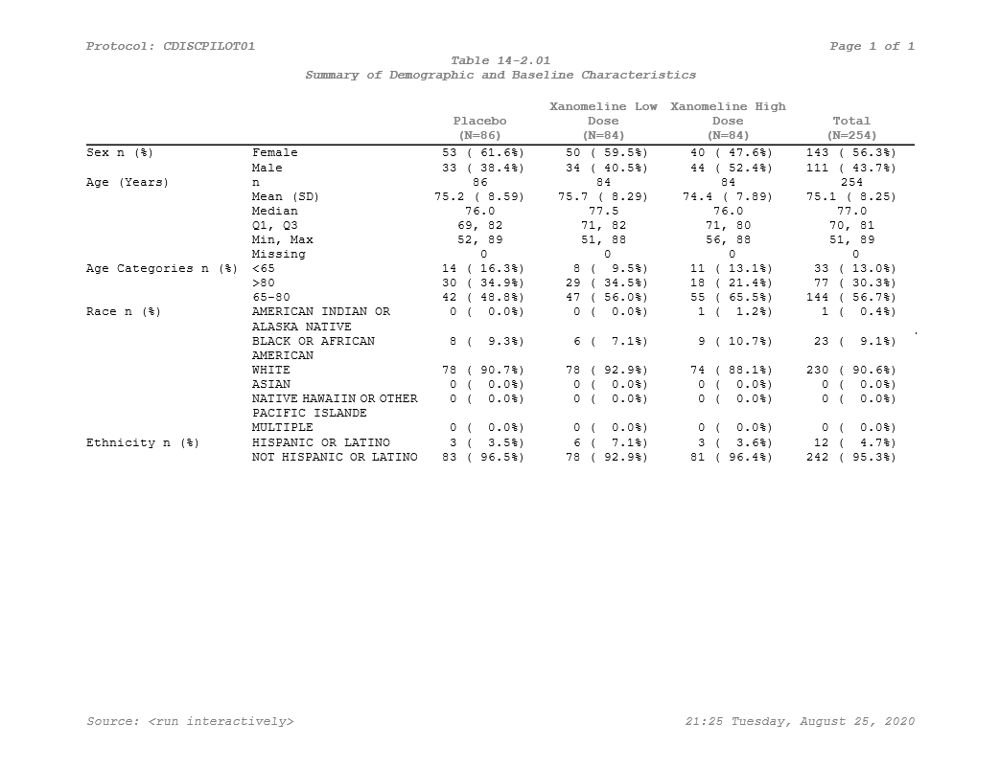

```{r, include = FALSE}
knitr::opts_chunk$set(
  collapse = TRUE,
  comment = "#>"
)
```

```{r, include = FALSE, setup}
library(Tplyr)
library(dplyr, warn.conflicts = FALSE)
library(knitr)
library(kableExtra)
load("adsl.Rdata")
```

In the other vignettes we talk about how to get the most out of 'Tplyr' when it comes to preparing your data. The last step we need to cover is how to get from the data output by 'Tplyr' to a presentation ready table.

There are a few things left to do after a table is built. These steps will vary based on what package you're using for presentation - but within this vignette we will demonstrate how to use ['huxtable'](https://hughjonesd.github.io/huxtable/) to prepare your table and ['pharmaRTF'](https://github.com/atorus-research/pharmaRTF) to write the output. 

After a 'Tplyr' table is built, you will likely have to:

- Sort the table however you wish using the provided order variables
- Drop the order variables once sorted
- Reorder the columns however you'd like them for presentation
- Apply row masking to blank out repeating values in row labels
- Set column headers within the data frame
- Create and style your 'huxtable' output
- Set up your RTF output with 'pharmaRTF'

Let's build a demographics table to see how this all works.

## Preparing the data

```{r demog_table}
adsl <- adsl %>% 
  mutate(
    SEX = recode(SEX, M = "Male", F = "Female"), 
    RACE = factor(RACE, c("AMERICAN INDIAN OR ALASKA NATIVE", "ASIAN", "BLACK OR AFRICAN AMERICAN", 
                          "NATIVE HAWAIIN OR OTHER PACIFIC ISLANDER", "WHITE", "MULTIPLE"))
  )

t <- tplyr_table(adsl, TRT01P) %>% 
  add_total_group() %>% 
  add_layer(name = 'Sex', 
    group_count(SEX, by = "Sex n (%)") %>% 
      set_missing_count(f_str('xx', n), NA) %>%
      set_denom_ignore(NA)
  ) %>% 
  add_layer(name = 'Age',
    group_desc(AGE, by = "Age (Years)")
  ) %>% 
  add_layer(name = 'Age group', 
    group_count(AGEGR1, by = "Age Categories n (%)") %>% 
      set_missing_count(f_str('xx', n), NA) %>%
      set_denom_ignore(NA)
  ) %>% 
  add_layer(name = 'Race', 
    group_count(RACE, by = "Race n (%)") %>% 
      set_missing_count(f_str('xx', n), NA) %>%
      set_denom_ignore(NA) %>% 
      set_order_count_method("byfactor")
  ) %>% 
  add_layer(name = 'Ethnic', 
    group_count(ETHNIC, by = "Ethnicity n (%)") %>% 
      set_missing_count(f_str('xx', n), NA) %>%
      set_denom_ignore(NA)
  )

dat <- build(t)

dat %>% 
  kable()

```

In the block above, we assembled the count and descriptive statistic summaries one by one. But notice that I did some pre-processing on the dataset. There are some important considerations here:

- 'Tplyr' does **not** do any data cleaning. We summarize and prepare the data that you enter. If you're following CDISC standards properly, this shouldn't be a concern - because ADaM data should already be formatted to be presentation ready. 'Tplyr' works under this assumption, and we won't do any re-coding or casing changes. In this example, the original `SEX` values were "M" and "F" - so I switched them to be "Male" and "Female" instead.
- The second pre-processing step does something interesting. If you recall from `vignette("sort")`, factor variables input to 'Tplyr' will use the factor order for the resulting order variable. Another particularly useful advantage of this is dummying values. The adsl dataset only contains the races "WHITE", "BLACK OR AFRICAN AMERICAN", and "AMERICAN INDIAN OR ALASK NATIVE". If you set factor levels prior to entering the data into 'Tplyr', the values will be dummied for you. This is particularly advantageous when a study is early on and data may be sparse. Your output can display complete values and the presentation will be consistent as data come in. 

## Sorting, Column Ordering, Column Headers, and Clean-up

Now that we have our data, let's make sure it's in the right order. Additionally, let's clean the data up so it's ready to present.

```{r presentation_prep}
dat <- dat %>% 
  arrange(ord_layer_index, ord_layer_1, ord_layer_2) %>% 
  apply_row_masks(row_breaks = TRUE) %>% 
  select(starts_with("row_label"), var1_Placebo, `var1_Xanomeline Low Dose`, `var1_Xanomeline High Dose`, var1_Total) %>%
  add_column_headers(
    paste0(" | | Placebo\\line(N=**Placebo**)| Xanomeline Low Dose\\line(N=**Xanomeline Low Dose**) ", 
           "| Xanomeline High Dose\\line(N=**Xanomeline High Dose**) | Total\\line(N=**Total**)"), 
           header_n = header_n(t))

dat %>% 
  kable()
```
Now you can see things coming together. In this block, we:

- Sorted the data by the layer, by the row labels (which in this case are just text strings we defined), and by the results. Review `vignette("sort")` to understand how each layer handles sorting in more detail.
- Used the `apply_row_masks()` function. Essentially, **after** your data are sorted, this function will look at all of your row_label variables and drop any repeating values. For packages like 'huxtable', this eases the process of making your table presentation ready, so you don't need to do any cell merging once the 'huxtable' table is created. Additionally, here we set the `row_breaks` option to `TRUE`. This will insert a blank row between each of your layers, which helps improve the presentation depending on your output. It's important to note that the input dataset **must** still have the `ord_layer_index` variable attached in order for the blank rows to be added. Sorting should be done prior, and column reordering/dropping may be done after.
- Re-ordered the columns and dropped off the order columns. For more information about how to get the most out of `dplyr::select()`, you can look into 'tidyselect' [here](https://tidyselect.r-lib.org/reference/select_helpers.html). This is where the `tidyselect::starts_with()` comes from.
- Added the column headers. In a huxtable, your column headers are basically just the top rows of your data frame. The 'Tplyr' function `add_column_headers()` does this for you by letting you just enter in a string to define your headers. But there's more to it - you can also create nested headers by nesting text within curly brackets ({}), and notice that we have the treatment groups within the two stars? This actually allows you to take the header N values that 'Tplyr' calculates for you, and use it within the column headers. As you can see in the first row of the output, the text shows the (N=XX) values populated with the proper header_n counts.


## Table Styling

There are a lot of options of where to go next. The ['gt'](https://gt.rstudio.com/) package is always a good choice, and we've been using ['kableExtra'](https://haozhu233.github.io/kableExtra/) throughout these vignettes. At the moment, with the tools we've made available in 'Tplyr', if you're aiming to create RTF outputs (which is still a common requirement in within pharma companies), ['huxtable'](https://hughjonesd.github.io/huxtable/) and our package ['pharmaRTF'](https://github.com/atorus-research/pharmaRTF) will get you where you need to go. 

_(Note: We plan to extend 'pharmaRTF' to support 'GT' when it has better RTF support)_

Alright - so the table is ready. Let's prepare the 'huxtable' table.

```{r huxtable}
# Make the table
ht <- huxtable::as_hux(dat, add_colnames=FALSE) %>%
  huxtable::set_bold(1, 1:ncol(dat), TRUE) %>% # bold the first row
  huxtable::set_align(1, 1:ncol(dat), 'center') %>% # Center align the first row 
  huxtable::set_align(2:nrow(dat), 3:ncol(dat), 'center') %>% # Center align the results
  huxtable::set_valign(1, 1:ncol(dat), 'bottom') %>% # Bottom align the first row
  huxtable::set_bottom_border(1, 1:ncol(dat), 1) %>% # Put a border under the first row
  huxtable::set_width(1.5) %>% # Set the table width
  huxtable::set_escape_contents(FALSE) %>% # Don't escape RTF syntax
  huxtable::set_col_width(c(.2, .2, .15, .15, .15, .15)) # Set the column widths
ht
```

# Output to File

So now this is starting to look a lot more like what we're going for! The table styling is coming together. The last step is to get it into a final output document. So here we'll jump into 'pharmaRTF'

```{r rtf_output}
doc <- pharmaRTF::rtf_doc(ht) %>% 
  pharmaRTF::add_titles(
    pharmaRTF::hf_line("Protocol: CDISCPILOT01", "PAGE_FORMAT: Page %s of %s", align='split', bold=TRUE, italic=TRUE),
    pharmaRTF::hf_line("Table 14-2.01", align='center', bold=TRUE, italic=TRUE),
    pharmaRTF::hf_line("Summary of Demographic and Baseline Characteristics", align='center', bold=TRUE, italic=TRUE)
  ) %>% 
  pharmaRTF::add_footnotes(
    pharmaRTF::hf_line("FILE_PATH: Source: %s", "DATE_FORMAT: %H:%M %A, %B %d, %Y", align='split', bold=FALSE, italic=TRUE)
  ) %>% 
  pharmaRTF::set_font_size(10) %>%
  pharmaRTF::set_ignore_cell_padding(TRUE) %>% 
  pharmaRTF::set_column_header_buffer(top=1)
```

This may look a little messy, but 'pharmaRTF' syntax can be abbreviated by standardizing your process. Check out [this vignette](https://atorus-research.github.io/tf_from_file.html) for instructions on how to read titles and footnotes into 'pharmaRTF' from a file. 

Our document is now created, all the titles and footnotes are added, and settings are good to go. Last step is to write it out. 

```{r write_out, eval=FALSE}
pharmaRTF::write_rtf(doc, file='styled_example.rtf')
```

And here we have it - Our table is styled and ready to go!

```{r show_table, out.width = "800px", echo = FALSE}

```

If you'd like to learn more about how to use 'huxtable', be sure to check out the [website](https://hughjonesd.github.io/huxtable/). For use specifically with 'pharmaRTF', we prepared a vignette of tips and tricks [here](https://atorus-research.github.io/huxtable_tips.html).
